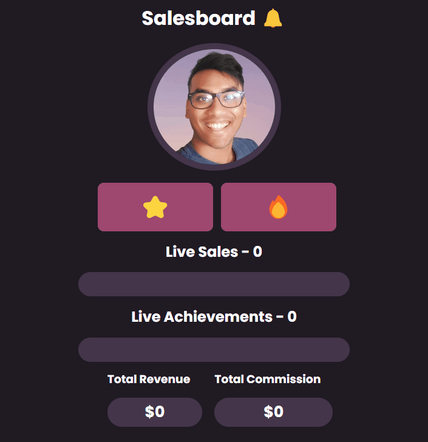

# Salesboard

A salesboard app to track the number of sales, achivements, as well as total revenue and comission.

Achievement conditions:

- 🔔 --> first sale of the day; no zero/red day for the rep.
- 💰 --> sold more than $2500 worth of products.
- 🏆 --> sold 15 products.

**Link to project:** https://salesboard.netlify.app/

## How's it made

**Tech used:** HTML, CSS, JavaScript

## Lessons Learned:

- I learnt how to use `event.target` to identify which button I clicked. More specifically I used the event.target.id to find retreive the button's id for a function.
- more practice using arrays, and to `.push` new items in it.
- Also good practice getting info from objects.
